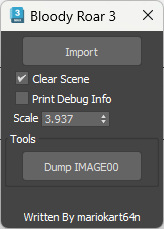

# Bloody Roar 3

 <!-- Replace with actual image URL if available -->

## Overview

**TTM_IMPORTER.ms** is a Work-In-Progress (WIP) MaxScript tool designed to extract and import game data from the PlayStation 2 game **Bloody Roar 3 (USA)**. This script facilitates the extraction of game assets from `.tbl` and `.dat` files and provides a user interface for importing TTM files and dumping game contents.

## Features

- **Extract Game Contents:**
  - Reads `.tbl` files to obtain file extraction information.
  - Accesses and extracts data from corresponding `.dat` files.
  - Handles special metadata entries at the end of `.dat` files.
  - Creates a structured directory hierarchy based on file paths specified in `.tbl` files.
  
- **User Interface:**
  - **Import Button:** Allows users to import TTM (3D model) files.
  - **Dump IMAGE00 Button:** Enables dumping of game contents from `IMAGE00.TBL` and `IMAGE00.DAT` files.
  - **Options:**
    - **Clear Scene:** Option to clear the current scene before importing.
    - **Print Debug Info:** Toggle to enable or disable debug information output.
    - **Scale Spinner:** Adjust the scale of imported models.

## Installation

1. **Clone the Repository:**

   ```bash
   git clone https://github.com/coreynguyen/mxs_bloody_roar_3_ps2.git
   ```

2. **Open MaxScript:**

   - Launch Autodesk 3ds Max.
   - Open the MaxScript editor (`Scripting` > `New Script`).

3. **Load the Script:**

   - Copy the contents of `bloody_roar_3_importer.ms` (the MaxScript file) into the MaxScript editor.
   - Execute the script (`File` > `Run Script` or press `Ctrl + E`).

4. **Use the Tool:**

   - A dialog titled **"Bloody Roar 3"** will appear with options to import TTM files and dump game contents.

## Usage

### Extracting `.tbl` and `.dat` Files

1. **Dump IMAGE00 Contents:**
   - Click the **"Dump IMAGE00"** button.
   - Select the `IMAGE00.TBL` or `IMAGE00.DAT` file when prompted.
   - The script will automatically locate the corresponding file (`.tbl` or `.dat`) and extract the contents into a structured directory.

2. **Importing TTM Files:**
   - Click the **"Import"** button.
   - Select the desired `.ttm` file.
   - Adjust the **Scale** spinner if necessary.
   - Check or uncheck **"Clear Scene"** and **"Print Debug Info"** as needed.
   - The script will import the TTM file into your 3ds Max scene.

### Directory Structure

When extracting files, the script creates a subfolder based on the `.dat` filename. For example, extracting from `IMAGE00.DAT` will create a directory structure like:

```
image00/
├── SE/
│   └── CMN/
│       └── CMN10.CFG
└── ... (other directories and files)
```

## Known Issues

- **Vertex Reading Errors:**
  - The current script does not fully handle vertex data correctly.
  - Some vertices are imported as `INF` (infinite) values, making them invalid.
  
- **Mesh Deformation:**
  - Imported meshes appear as collapsed geometry due to incorrect handling of relative bone assignments.
  
- **Skeleton Transformation:**
  - The script currently does not correctly extract and transform the skeleton into world space.
  - Proper vertex import relies on accurate skeleton transformation, which is not yet implemented.

### Future Improvements

- **Vertex Validation:**
  - Implement checks to handle and correct `INF` vertex values.
  
- **Skeleton Transformation:**
  - Develop functionality to accurately transform the skeleton into world space before vertex import.
  
- **Mesh Integrity:**
  - Ensure meshes are imported correctly without deformation, maintaining their intended structure and appearance.
